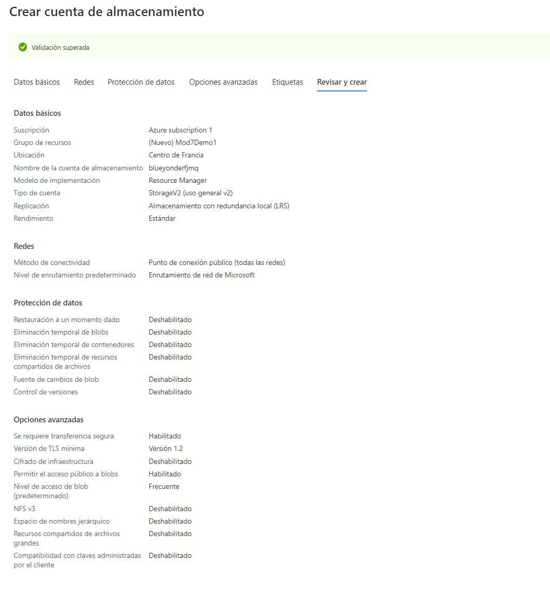
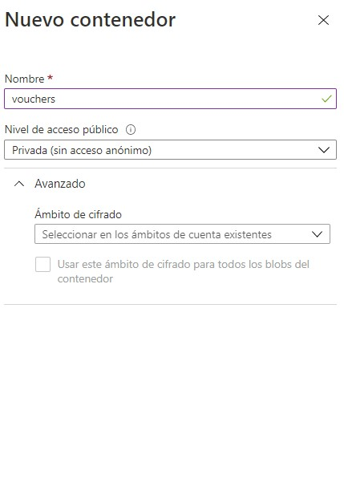
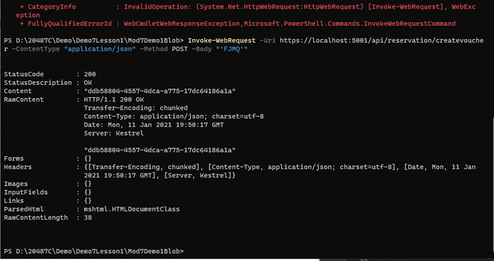
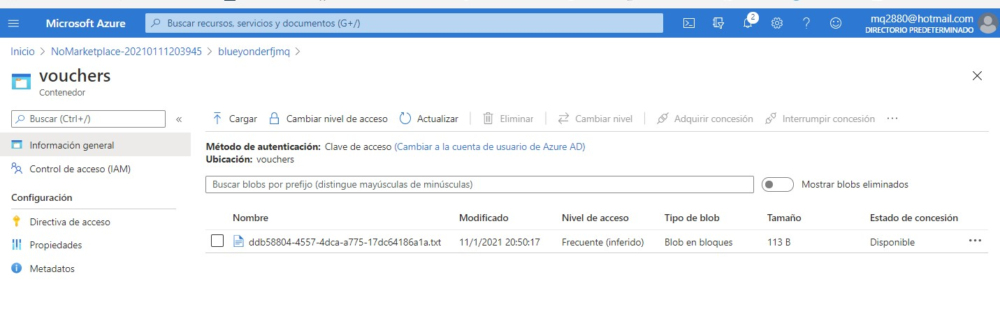
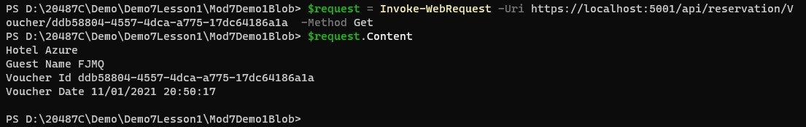
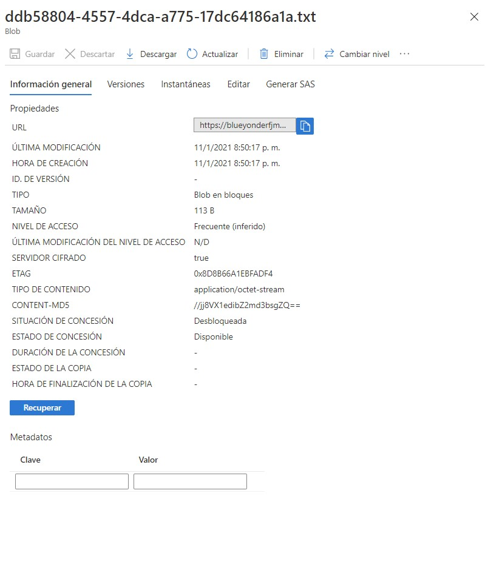

# Module 7: Implementing data storage in Azure

# Lesson 2: Accessing Data in Azure Storage

### Demonstration: Accessing Microsoft Azure Blob Storage from a Microsoft ASP.NET Core Application

- Creamos una cuenta de almacenamiento

  



- Creamos un nuevo contenedor



- Abrimos el proyecto Mod7Demo1Blob 
- En el **appsettings.json** reemplazamos el **connection string**.con la cadena de conexion del contenedor
- Ejecutamos
- Invocamos el  **CreateVoucher** 

   ```bash
    [System.Net.ServicePointManager]::SecurityProtocol = [System.Net.SecurityProtocolType]::Tls12;
    Invoke-WebRequest -Uri https://localhost:5001/api/reservation/createvoucher -ContentType "application/json" -Method POST -Body "'FJMQ'"
   ```

   >**Note**: Replace **{Your Name}** with Your name.



- copiamos el **Guid** key.

- Vamos al  **vouchers** container y verificamos que se ha añadido un nuevo fichero



1. Invocamos **GetVoucher** action y recogemos el nuevo fichero

   ```bash
    $request = Invoke-WebRequest -Uri https://localhost:5001/api/reservation/Voucher/ddb58804-4557-4dca-a775-17dc64186a1a -Method Get
    $request.Content
   ```


​	

